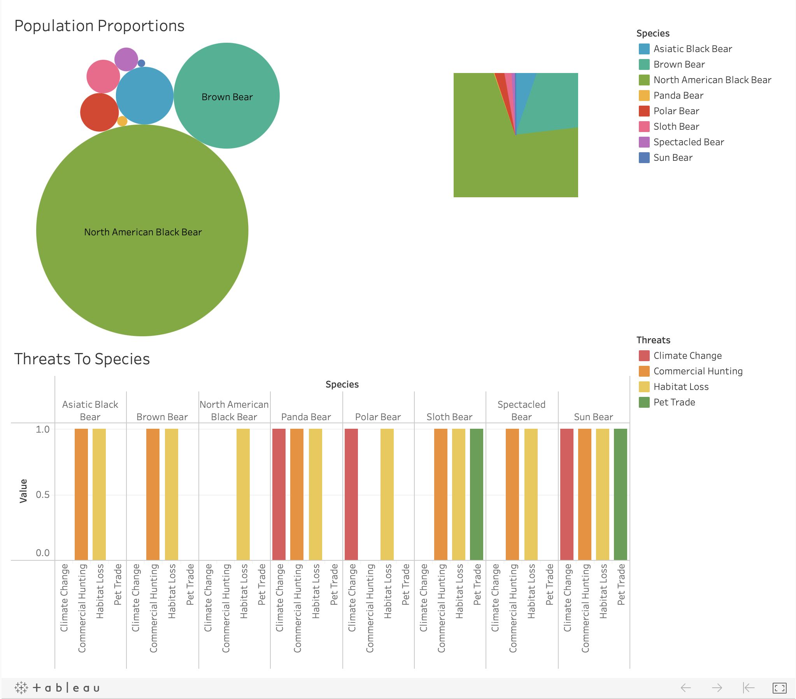
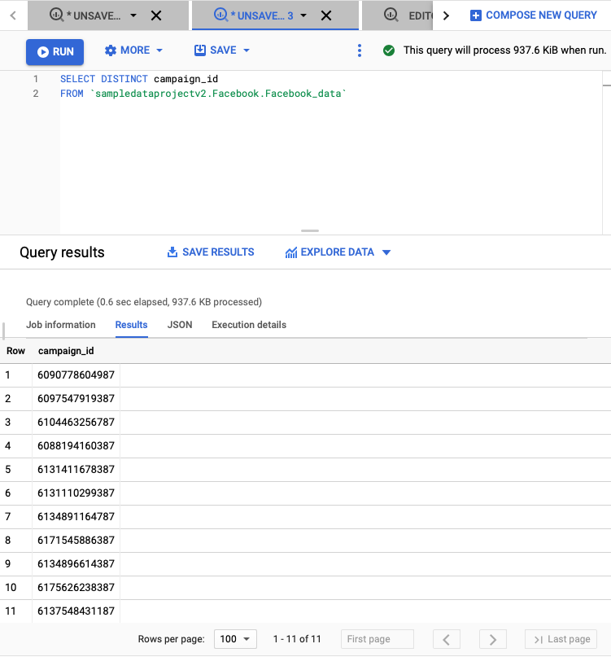
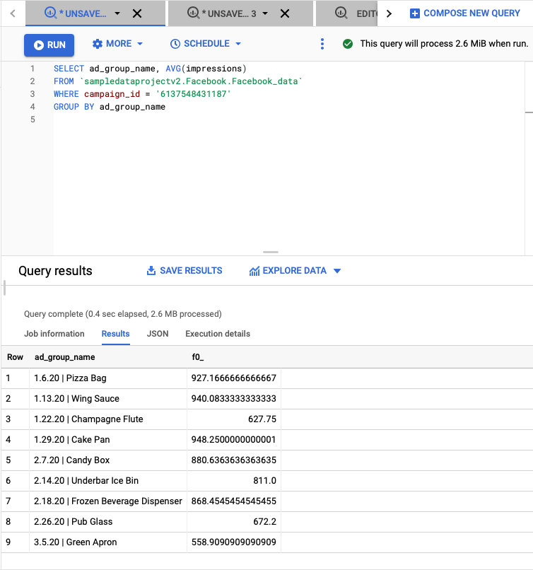
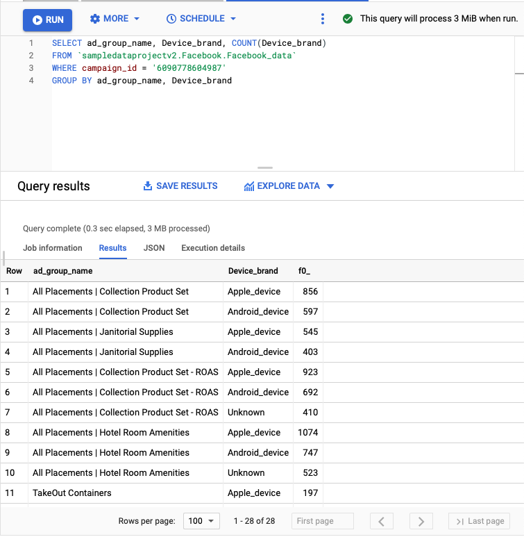
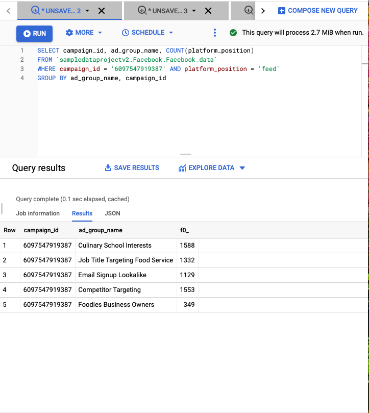

## Alternative Rock Band Origin Locations Over the Decades

<a href="https://public.tableau.com/profile/hunter.walker#!/vizhome/AltRock/Sheet1?publish=yes">Tableau Public Link</a>
 
[ipynb File](pdf/AltRock.ipynb)
 
[Final Data Set](pdf/geospatial.pdf)

**Project description:** Through the Wikipedia library available to Python I gathered, from <a href="https://en.wikipedia.org/wiki/List_of_lists_of_lists">List of Lists of Lists</a>,
a set of over 1,200 Alternative Rock artists' origin location and start date. From there I proceeded to clean the data, removing unnecessary links, 
fixing improperly formatted cells and gathering, through GeoPy, the necessary geospatial data needed to allow myself to create a functional map within Tableau.
Most of the described processes were automated within Google Colaboratory. I was able to scrape and specify my needed data through Beautiful Soup and the Wikipedia
Library.

### Technologies 

 <a href="https://www.python.org">1. Python</a>
   
 <a href="https://pypi.org/project/wikipedia/">2. Wikipedia Library</a>
   
 <a href="https://pandas.pydata.org">3. Pandas</a>
   
 <a href="https://www.crummy.com/software/BeautifulSoup/">4. Beautiful Soup</a> 
   
 <a href="https://www.tableau.com">5. Tableau</a>  
   
    
   
   <a href="https://geopy.readthedocs.io/en/stable/">7. GeoPy</a>  
   

  

## National Parks and Forests in the United States

<a href="https://public.tableau.com/profile/hunter.walker#!/vizhome/NatlParks_Forests/Sheet1?publish=yes">Tableau Public Link</a>
 
[ipynb File](pdf/NatlParksForests.ipynb)
 
[Final Data Set](pdf/Parks_Forests.pdf)

**Project description:** Through the Wikipedia library available to Python I gathered, from <a href="https://en.wikipedia.org/wiki/List_of_national_parks_of_the_United_States">List of national parks in the United States</a>, and <a href="https://en.wikipedia.org/wiki/List_of_national_forests_of_the_United_States">List of national forests in the United States</a>, all relevant geographic data which was then mapped through Tableau. The final result reflects the distance from my personal home in the state of Florida.

### Technologies 

 <a href="https://www.python.org">1. Python</a>
   
 <a href="https://pypi.org/project/wikipedia/">2. Wikipedia Library</a>
   
 <a href="https://pandas.pydata.org">3. Pandas</a>
   
 <a href="https://www.crummy.com/software/BeautifulSoup/">4. Beautiful Soup</a> 
   
 <a href="https://www.tableau.com">5. Tableau</a>  
   
    
   
   <a href="https://geopy.readthedocs.io/en/stable/">7. GeoPy</a>  
   
 <a href="https://numpy.org">8. NumPy</a>  
   

  

## Bear Populations and Threats

<a href="https://public.tableau.com/profile/hunter.walker#!/vizhome/BearStatus/Dashboard1">Tableau Public Link</a>
 

### Technologies 

 <a href="https://www.tableau.com">1. Tableau</a>  
   
 <a href="https://www.microsoft.com/en-us/microsoft-365/excel">2. Microsoft Excel</a>  
   
   <a href="https://www.apple.com/numbers/">3. Apple Numbers</a>  
   
 

  
 
 
## Company 'X' Data Analysis

**Step 1:** I first needed to take into account the unique campaigns present and their internal ad groupings. 

 
**Step 2:** I then utilized aggregate functions (MAX, AVG) to conceptualize the performance of each ad grouping in terms of 'impressions.'

 
**Step 3:** The goal was to view the impressions against the device brand in order to determine the impact of brand on ad performance. In all cases other than campaign #2 (6097547919387, Awareness | Lead Gen Email Signups), Apple devices were used to view ads more so. Thus, given any increase in concentration of Android devices, I was looking for differences in impression data.  

 
<a href="https://public.tableau.com/profile/hunter.walker#!/vizhome/AltRock/Sheet1?publish=yes">Tableau Public Link</a>
 
## [Impressions vs. Device Brand](pdf/companyX_impressions_vs_brand.pdf)
 

 
## [Platform Position Per Ad Group Per Campaign](pdf/companyX_platform_position_perAdGroup_perCampaign.pdf)
 
  
